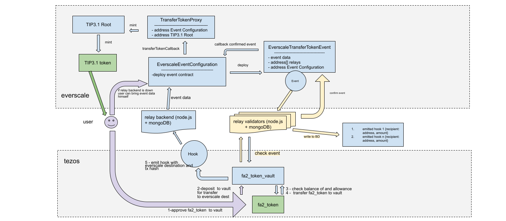

# Everscale Tezos Bridge Smartcontracts

## Tezos to Everscale Bridge architecture

https://docs.google.com/drawings/d/1uDfCchXOzKv1HqMH3TfYMlF3FKw-ewLjQi3cOq_jjH4/edit?usp=sharing

## Everscale to Tezos Bridge architecture

https://docs.google.com/drawings/d/1CMoL4vS-Ppza8UB9ypat9BUnHTzVQdbofgH1aPEjrnw/edit?usp=sharing

## Description
For bridge between Everscale and Tezos following financial assets are used:
 * FA1.2 & FA2 token standard - for Tezos https://gitlab.com/tezos/tzip/-/blob/master/proposals/tzip-12/tzip-12.md
 * TIP3 v5 token standard - for Everscale https://github.com/broxus/ton-eth-bridge-token-contracts

Tezos smartcontracts:
 - [`tezos`](tezos/) - contracts code defined in [LIGO](https://ligolang.org/),
   smart-contract language for Tezos.
   - [`tezos/fa2_single_asset_with_hooks_assembl.mligo`](tezos/fa2_single_asset_with_hooks_assembl.mligo) - standart FA2 single asset token smartcontract from https://github.com/oxheadalpha/smart-contracts/tree/master/single_asset
     this contract use onchain token metadata storage and have 8 interact endpoints:
     - `update_operators`  https://better-call.dev/hangzhou2net/KT1Ua1r4kEBUQ4vP546QyCc5WK6sadvesoPu/interact?entrypoint=update_operators with two options:
       * `add_operator`
       * `remove_operator`
     - `transfer`  https://better-call.dev/hangzhou2net/KT1Ua1r4kEBUQ4vP546QyCc5WK6sadvesoPu/interact?entrypoint=transfer
     - `set_admin`  https://better-call.dev/hangzhou2net/KT1Ua1r4kEBUQ4vP546QyCc5WK6sadvesoPu/interact?entrypoint=set_admin
     - `confirm_admin`  https://better-call.dev/hangzhou2net/KT1Ua1r4kEBUQ4vP546QyCc5WK6sadvesoPu/interact?entrypoint=confirm_admin
     - `pause`  https://better-call.dev/hangzhou2net/KT1Ua1r4kEBUQ4vP546QyCc5WK6sadvesoPu/interact?entrypoint=pause
     - `mint_tokens`  https://better-call.dev/hangzhou2net/KT1Ua1r4kEBUQ4vP546QyCc5WK6sadvesoPu/interact?entrypoint=mint_tokens
     - `burn_tokens`  https://better-call.dev/hangzhou2net/KT1Ua1r4kEBUQ4vP546QyCc5WK6sadvesoPu/interact?entrypoint=burn_tokens
     - `balance_of`  https://better-call.dev/hangzhou2net/KT1Ua1r4kEBUQ4vP546QyCc5WK6sadvesoPu/interact?entrypoint=balance_of for onchain check balance by other smartcontracts

   - [`tezos/fa2_vault.ligo`](tezos/fa2_vault.ligo) - vault smartcontract for storage and delivery FA2 single asset token with bridge interaction
   this contract have 3 interact endpoints:
     - `balance_of_callback` https://better-call.dev/hangzhou2net/KT1RAWE7SBg7NH7UuduktHjJv7gXhkEdf5ya/interact?entrypoint=balance_of_callback
     - `deposit_to_vault` https://better-call.dev/hangzhou2net/KT1RAWE7SBg7NH7UuduktHjJv7gXhkEdf5ya/interact?entrypoint=deposit_to_vault
     - `withdraw_from_vault` https://better-call.dev/hangzhou2net/KT1RAWE7SBg7NH7UuduktHjJv7gXhkEdf5ya/interact?entrypoint=withdraw_from_vault

## Getting started
